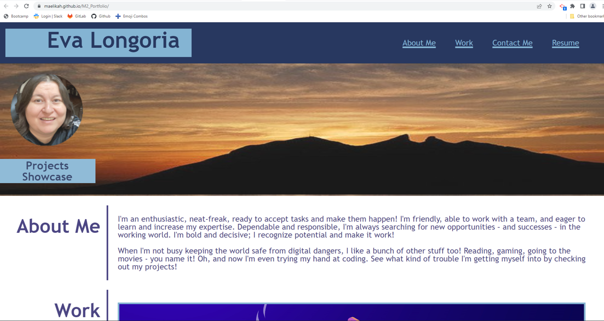

# Module 2 Challenge

## Description

This webpage has been created to satisfy the Coding Bootcamp's second challenge. It contains a webpage that I created and that is similar to the provided mockup .gif 

The main purpose of the challenge was to apply the concepts learned during the second week of the bootcamp. Particularly those related to Flexbox and responsiveness using media queries.

This was a hard challenge to me as I had to investigate a lot to make the contents look like the mockup. I still have some doubts related to flexbox concepts, however reverse engineering similar pages helped me. I will continue to study this topic on my own to try to master it. 

## Usage

The webpage should be navigated and the following acceptance criteria should be tested and validated:

---
* GIVEN a portfolio webpage
* WHEN I load the page
* THEN I am presented with the developer's name, a recent photo or avatar, and links to sections about them, their work, and how to contact them
* WHEN I click one of the links in the navigation
* THEN the UI scrolls to the corresponding section
* WHEN I click on the link to the section about their work
* THEN the UI scrolls to a section with titled images of the developer's applications
* WHEN I am presented with the developer's first application
* THEN that application's image should be larger in size than the others
* WHEN I click on the images of the applications
* THEN I am taken to that deployed application (applicable only for Prework and Challenge 1)
* WHEN I resize the page or view the site on various screens and devices
* THEN I am presented with a responsive layout that adapts to my viewport
---

The github URL containing the code for this challenge is located at:

https://github.com/Maelikah/M2_Portfolio

The github pages URL containing the deployed webpage is located at:

https://maelikah.github.io/M2_Portfolio/

Here is a screenshot of the deployed webpage for reference:

## Credits

Flexbox & Responsive Web Design tutorials:

* https://webflow.com/blog/flexbox-and-css-grid
* https://www.freecodecamp.org/news/css-flexbox-tutorial-with-cheatsheet/
* https://web.dev/learn/design/
* https://www.vecteezy.com/
* http://www.freepik.com/

## License

N/A

